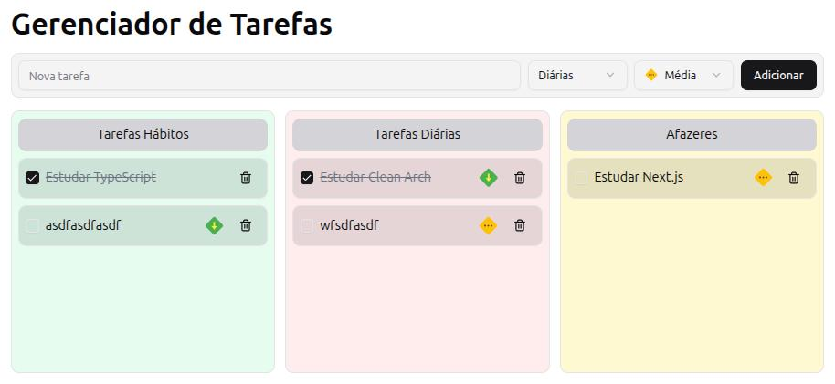

# Gerenciador de Tarefas
## ( Clean Arch na Prática )

A aplicação desenvolvida neste projeto tem o objetivo de gerenciar tarefas servindo como pano de fundo e um exemplo simples de como utilizar a arquitetura Clean Arch e principios SOLID na prática.

## Objetivos

- Desenvolver uma aplicação para gerenciar tarefas.
- Utilizar o padrão arquitetural Clean Arch.
- Utilizar princípios SOLID.

## Tecnologias Utilizadas

- Next
- Tailwind
- Typescript
