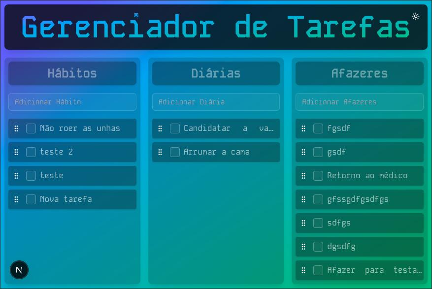

# Gerenciador de Tarefas (Clean Arch na Prática)

A aplicação desenvolvida neste projeto tem o objetivo de gerenciar tarefas e servir como pano de fundo e um exemplo simples de como utilizar a arquitetura Clean Arch e princípios SOLID na prática.

Apesar da simplicidade do caso de uso, ela é uma aplicação full stack com Next.js, Tailwind e Typescript possuindo front-end e back-end que se comunicam via API.

<div style="text-align: center; border: 1px dashed #ccc; padding: 10px; border-radius: 16px ">



</div>

## Objetivos

- Desenvolver uma aplicação para gerenciar tarefas.
- Utilizar o padrão arquitetural Clean Arch.
- Utilizar princípios SOLID.
- Persistir os dados em um arquivo json.

## Recursos

[x] Incluir de tarefas.
[x] Remover tarefa.
[x] Marcar tarefa como concluída.
[] Editar tarefa.
[x] Listar tarefas.
[x] Ocultar tarefas concluidas.
[] Mover tarefa entre categorias.
[] Organizar tarefas por prioridade.
[x] Salvar tarefas em arquivo json.

## Tecnologias Utilizadas

- Next
- Tailwind
- Typescript
- Shadcn/ui

## Instalação

- Clonar o repositório
- Instalar dependências

Digite os comandos abaixo para clonar o repositório e instalar as dependências:

```bash
git clone https://github.com/esbnet/task-manager-clean-arch-example.git
cd task-manager-clean-arch-example
npm install
```

## Executar
Rodar o servidor de desenvolvimento:

```bash
npm run dev
```
